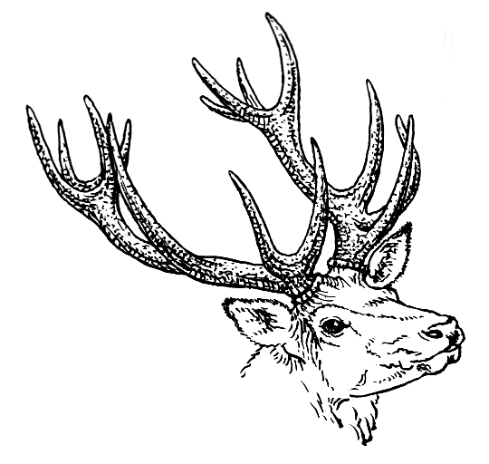

        
        <h1>Beau</h1>

###### Match C's capability in style

Beau is a language I am defining and implementing for learning purposes,
but also an interest in seeing some of my ideas applied. Beau will match C's
capability in style. I want a utilitarian systems language that is pleasing to
the eye.

Some of the ideas I've brought to the language are originally inspired by the
original B language but with my own twist. 

### Status

Mostly complete front end, working on a simple back end with LLVM to get a
compiler up and running.

### Grammar

Check the EBNF grammar in `GRAMMAR`.

### Examples

Check some examples of what I'm going for in `examples.b`.

### License

BSD 3-Clause License, see `LICENSE`.